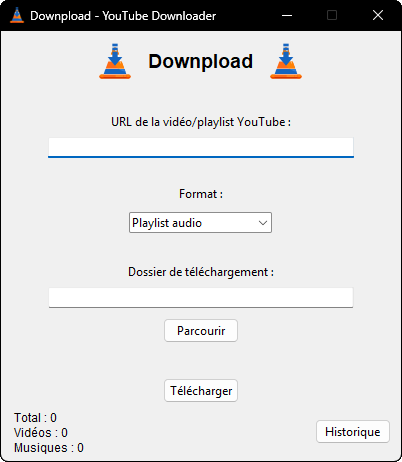

# 🎵📥 Downpload - YouTube Downloader

Downpload est une petite application de bureau en Python (Tkinter) permettant de télécharger facilement des vidéos ou de la musique depuis YouTube, au format MP4 ou MP3, ou bien une playlist d'audio en MP3.  
Une base de données SQLite intégrée garde la trace de tous vos téléchargements 📊.

***Dû à Pytubefix qui n'est pas encore à jour au 14/04/2025, l'application bureau tourne au maximum avec Python 3.12.2***

---

## ⚙️ Fonctionnalités

- Téléchargement de vidéos YouTube en qualité maximale (1080p en MP4) (via `ffmpeg`)
- Téléchargement d'audio uniquement, avec conversion en MP3 (via `ffmpeg`)
- Téléchargement de playlist d'audio (via `ffmpeg`)
- Interface simple et intuitive avec `Tkinter`
- Historique automatique des téléchargements (SQLite)
- Compatible Windows

---

## 💻 Installation

### 1. Clonez le repo
```bash
git clone https://github.com/FoxW-Lois/Downpload.git
cd downpload
```

### 2. Installez les dépendances Python
Utilisez un environnement virtuel si possible (recommandé) :
```bash
python -m venv venv
venv\Scripts\activate   # Sur Windows
```

*Ou bien installez directement sur la machine pour éviter les problèmes de compatibilité si Pycharm/Anaconda ne sont pas installés*

Puis installez les paquets :
```bash
pip install -r requirements.txt
```

**Fichier `requirements.txt` suggéré :**
```text
pytubefix
pydub
pillow
```

---

## 🔧 Installation de `ffmpeg` (obligatoire pour le téléchargement audio et vidéo)

La conversion en MP3 nécessite `ffmpeg`, un outil puissant de traitement audio/vidéo. Voici comment l'installer :

1. Rendez-vous sur 👉 [https://www.gyan.dev/ffmpeg/builds/](https://www.gyan.dev/ffmpeg/builds/)
2. Téléchargez l'archive **`ffmpeg-git-full.7z`**
3. Extrayez-la dans un dossier de votre choix (ex: `C:\ffmpeg`)
4. Copiez le chemin du dossier `bin` (ex: `C:\ffmpeg\bin`)
5. Ajoutez ce chemin à la variable d'environnement **`PATH`** :
    - Recherche "variables d'environnement" dans le menu Démarrer
    - Cliquez sur "Path" > Modifier > Nouveau
    - Collez le chemin du dossier `bin`
6. Redémarrez votre terminal ou votre éditeur de code

---

## 🚀 Lancer l'application

```bash
python app.py
```

---

## 🗃️ Base de données

L'application crée un fichier `downloads.db` qui enregistre automatiquement :
- Le titre de la vidéo
- L’URL
- Le format (Audio ou Vidéo)
- Le chemin de sauvegarde
- La date du téléchargement

---

### 3. Créer une nouvelle version de l'application en .exe
Ajouter les packages PyInstaller si besoin :
```bash
pip install pyinstaller
```

Puis pour compiler une nouvelle version du projet en .exe  :
```bash
pyinstaller --onefile --noconsole --icon=icon.ico --add-data "icon.png;." app.py
```
Le nouveau build se trouve dans le dossier `dist` avec le nom `app.exe`. Il faut donc penser à le renommer en `downpload.exe`.
Pour le lancement de l'application, il faut donc lancer le fichier `Downpload.exe`, en incluant dans le dossier racine les fichiers `icon.png` et `icon.ico`. Il est aussi nécessaire d'installer l'outil `ffmpeg` (comprenant de base ffprobe) sur l'ordinateur, et d'inclure l'outil dans les variables d'environnement (voir la section README consacrée plus haut).

---

## 📸 Aperçu


